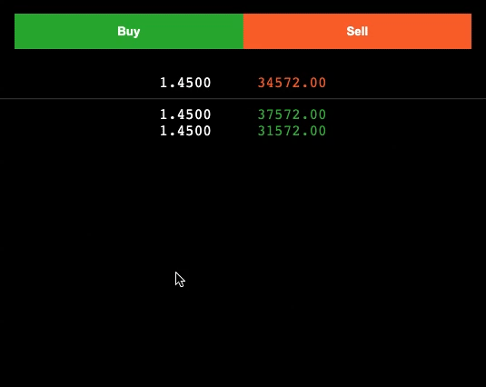
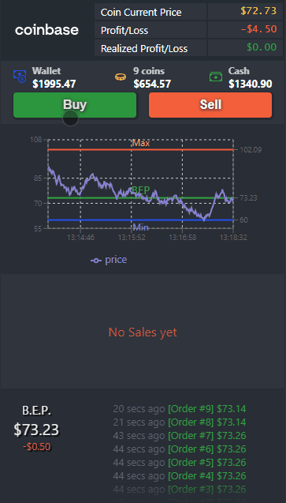

# React Sample Coin Trader

Project created with `create-react-app`.

To run locally:

```sh
yarn install
yarn start
```

Or visit 📈 [Coin Trader (Live page)](http://jelitter.github.io/coin-trader)

<br>

---

Some dependencies:

-   `react-countup`
-   `react-icons`
-   `recharts`
-   `uuid`

<br>

---

## 📝 Exercise:

[](example.gif)

## 👉 Implementation:

[](coin-trader.gif)

<br>

---

### Isaac Sanchez, 2021
