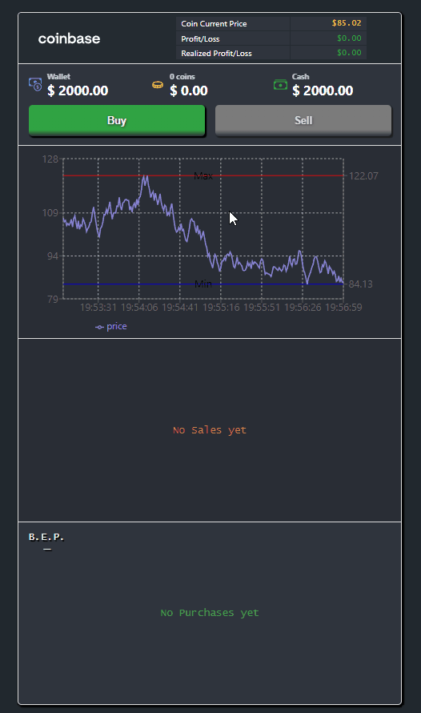

# React Sample Coin Trader

## Isaac Sanchez, 2021

Project created with `create-react-app`.

Some dependencies:

-   `recharts`
-   `uuid`
-   `react-icons`

 

---

📈 [Coin Trader (Live page)](http://jelitter.github.io/coin-trader)

---

## Exercise:

## Implementation:

